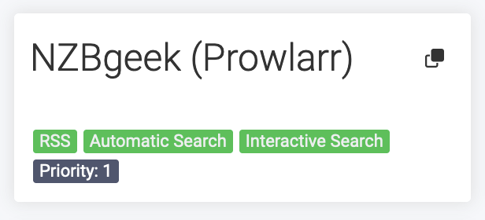
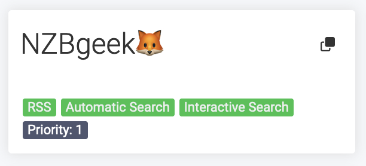
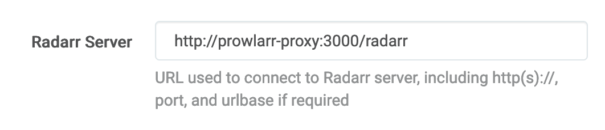

# 🦊 prowlarr-proxy

### ✂️ Remove or replace Prowlarrs suffix from indexer name - ` (Prowlarr)`

Before:



After (with emoji suffix):



## 🚀 Running

1. Start the application

```sh
docker run -p 3000:3000 -v $(pwd)/config:/config -it ghcr.io/benjick/prowlarr-proxy:latest
```

2. Edit `./config/config.yml` with your desired values

> 🖐️ The app only reads the configuration file at startup, so restart the server after making any changes.

3. Update your Application in Prowlarr to use the proxy:



4. Press "🔄 Sync App Indexers" in Prowlarr to update the indexers

### 🐳 `docker-compose.yml`

```yml
services:
  prowlarr-proxy:
    image: ghcr.io/benjick/prowlarr-proxy:latest
    ports:
      - 3000:3000
    volumes:
      - ./config:/config
```
